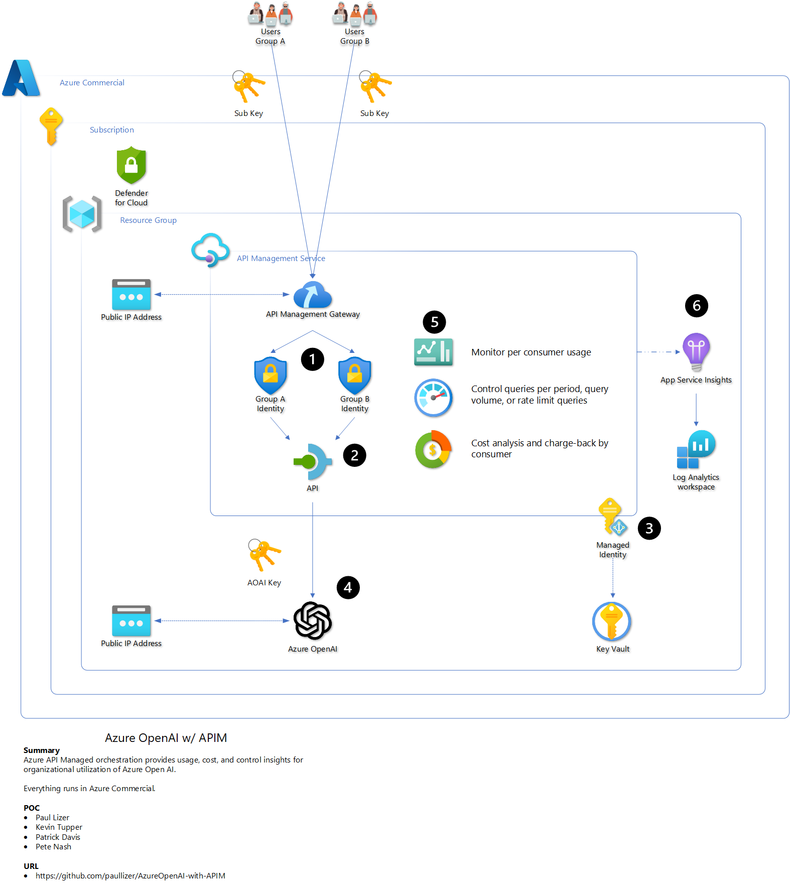
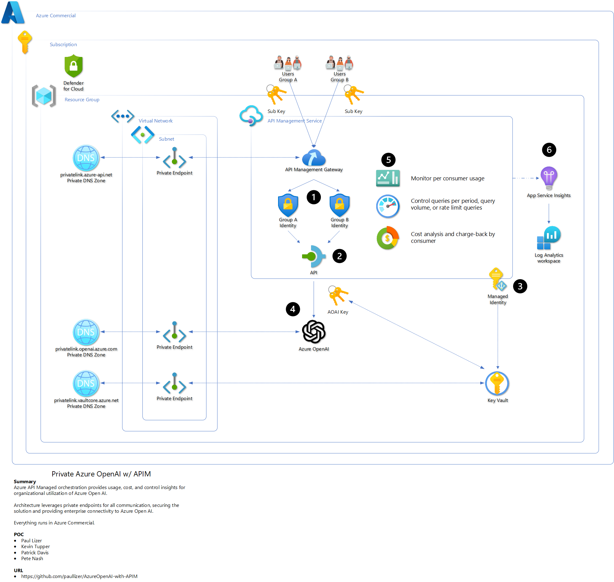
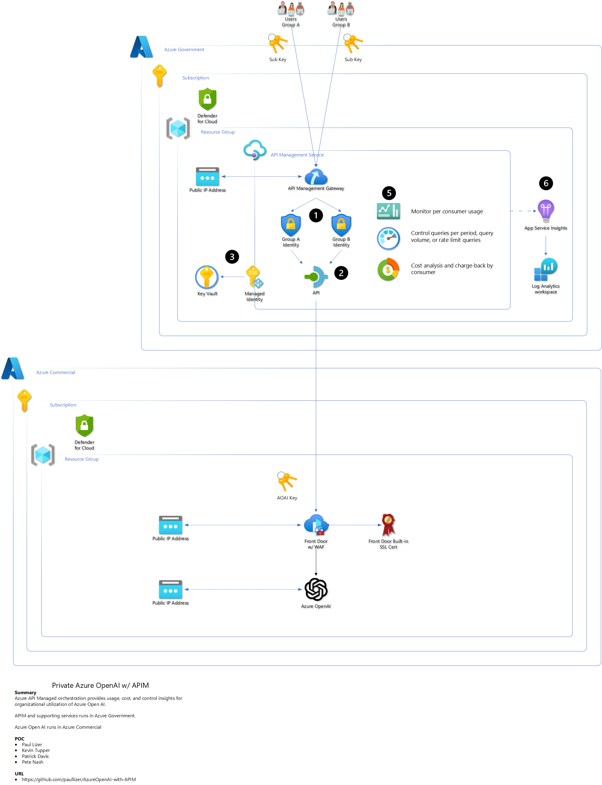
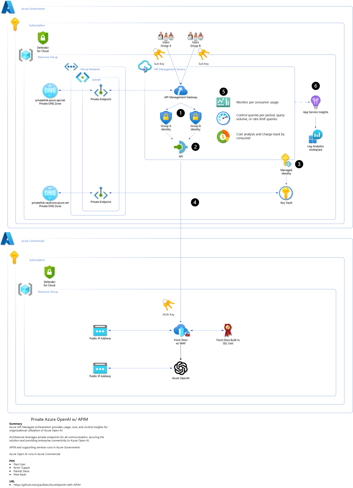

# Manage Azure Open AI using APIM

## Overview

Using Azure's APIM orchestration provides a organizations with a powerful way to scale and manage their Azure Open AI service without deploying Azure Open AI endpoints everywhere. Administrators can issue subscription keys via APIM for accessing a single Azure Open AI service instead of having teams share Azure Open AI keys. APIM delivers usage metrics along with API monitoring to improve business intelligence. APIM policies control access, throttling, and a mechanism for chargeback cost models.

### Solutions

There are four solutions developed to meet the needs of the organization from a sandbox to model a production environment. 

- [Azure Commercial API Management to Azure Open AI](#azure-commercial-api-management-to-azure-open-ai)
- [Azure Commercial API Management to Azure Open AI with private endpoints](#azure-commercial-api-management-to-azure-open-ai-with-private-endpoints)
- [Azure Government API Management to Azure Open AI](#azure-government-api-management-to-azure-open-ai)
- [Azure Government API Management to Azure Open AI with private endpoints](#azure-government-api-management-to-azure-open-ai-with-private-endpoints)

### Using it

Once the service is deployed, use the following section to understand how to access your Azure Open AI service via APIM.

- [Steps and examples on how to use your APIM-based API to query your Azure Open AI API](#tying-it-all-together)

### Prerequisites

#### Azure 

- Contributor permissions to subscription or resource group
- Resource Group (or ability to create)
- Azure Open AI service deployed
  - [How-to: Create and deploy an Azure OpenAI Service resource - Azure OpenAI | Microsoft Learn](https://learn.microsoft.com/en-us/azure/ai-services/openai/how-to/create-resource?pivots=web-portal)

- Azure Open AI model deployed
  - [How-to: Create and deploy an Azure OpenAI Service resource - Azure OpenAI | Microsoft Learn](https://learn.microsoft.com/en-us/azure/ai-services/openai/how-to/create-resource?pivots=web-portal#deploy-a-model)

- Azure Open AI service URL
  - [Quickstart - Deploy a model and generate text using Azure OpenAI Service - Azure OpenAI | Microsoft Learn](https://learn.microsoft.com/en-us/azure/ai-services/openai/quickstart?tabs=command-line&pivots=rest-api#retrieve-key-and-endpoint)

- Azure Open AI key
  - [Quickstart - Deploy a model and generate text using Azure OpenAI Service - Azure OpenAI | Microsoft Learn](https://learn.microsoft.com/en-us/azure/ai-services/openai/quickstart?tabs=command-line&pivots=rest-api#retrieve-key-and-endpoint)

- Azure Open AI service public IP
  - ***Azure Government w/ Private Endpoint Deploy Solution Only*** 
  - [How-to: Get the public IP address of Azure Open AI service](#get-public-ip-address-of-my-azure-open-ai-service)


#### One-Button

Each solution provides a simple one-button deployment. Select the "Deploy to Azure" button which will open the Azure portal and provide a form for details.

#### Command Line

To use the command line deployment method, fork the library and use Codespaces or clone the forked library to your local computer.

- [GitHub Codespaces](https://github.com/features/codespaces)

##### Azure CLI

- [How to install the Azure CLI | Microsoft Learn](https://learn.microsoft.com/en-us/cli/azure/install-azure-cli)
- [Connect to Azure Government with Azure CLI - Azure Government | Microsoft Learn](https://learn.microsoft.com/en-us/azure/azure-government/documentation-government-get-started-connect-with-cli)

##### Azure PowerShell

- [How to install Azure PowerShell | Microsoft Learn](https://learn.microsoft.com/en-us/powershell/azure/install-azure-powershell?view=azps-10.2.0)
- [Connect to Azure Government with PowerShell - Azure Government | Microsoft Learn](https://learn.microsoft.com/en-us/azure/azure-government/documentation-government-get-started-connect-with-ps)

## Architectures

Summary

- 

### Azure Commercial API Management to Azure Open AI

Description



#### Deploy

**! NOTE !** - It can take up to 45 minutes for all services to deploy as API Management has many underlying Azure resources deployed running the service.

##### One Button

Simple one-button deployment, opens in Azure Portal

[](https://portal.azure.com/#create/Microsoft.Template/uri/https%3A%2F%2Fraw.githubusercontent.com%2Fpaullizer%2FAzureOpenAI-with-APIM%2Fmain%2Fpublic-apim.json)

##### Azure CLI

```powershell
# Update the following variables to use the appropriate resource group and subscription.
$resourceGroupName = "RG-APIM-OpenAI"
$location = "East US"
$subscriptionName = "MySubscription"

az login
az account set --subscription $subscriptionName
az group create --name $resourceGroupName --location $location
az deployment group create --resource-group $resourceGroupName  --template-file .\public-apim.bicep --mode Incremental
```

##### Azure PowerShell

```powershell
# Update the following variables to use the appropriate resource group and subscription.
$resourceGroupName = "RG-APIM-OpenAI"
$location = "East US"
$subscriptionName = "MySubscription"

Connect-AzAccount
Set-AzContext -Subscription $subscriptionName
New-AzResourceGroup -Name $resourceGroupName -Location $location
New-AzResourceGroupDeployment -ResourceGroupName $resourceGroupName -TemplateFile .\public-apim.bicep -Verbose -mode Incremental
```

#### Tying it all together

- Now that APIM is deployed and automatically configured to work with your Azure Open AI service
  - [Click here to learn how do you use the APIM endpoint to interact with Azure Open AI?](#tying-it-all-together)

### Azure Commercial API Management to Azure Open AI with private endpoints

Description



#### Deploy

**! NOTE !** - It can take up to 45 minutes for all services to deploy as API Management has many underlying Azure resources deployed running the service.

##### One Button

Simple one-button deployment, opens in Azure Portal

[](https://portal.azure.com/#create/Microsoft.Template/uri/https%3A%2F%2Fraw.githubusercontent.com%2Fpaullizer%2FAzureOpenAI-with-APIM%2Fmain%2Fprivate-apim.json)

##### Azure CLI

```powershell
# Update the following variables to use the appropriate resource group and subscription.
$resourceGroupName = "RG-APIM-OpenAI"
$location = "East US"
$subscriptionName = "MySubscription"

az login
az account set --subscription $subscriptionName
az group create --name $resourceGroupName --location $location
az deployment group create --resource-group $resourceGroupName  --template-file .\private-apim.bicep --mode Incremental
```

##### Azure PowerShell

```powershell
# Update the following variables to use the appropriate resource group and subscription.
$resourceGroupName = "RG-APIM-OpenAI"
$location = "East US"
$subscriptionName = "MySubscription"

Connect-AzAccount
Set-AzContext -Subscription $subscriptionName
New-AzResourceGroup -Name $resourceGroupName -Location $location
New-AzResourceGroupDeployment -ResourceGroupName $resourceGroupName -TemplateFile .\private-apim.bicep -Verbose -mode Incremental
```

### Azure Government API Management to Azure Open AI

Description



#### Deploy

**! NOTE !** - It can take up to 45 minutes for all services to deploy as API Management has many underlying Azure resources deployed running the service.

##### One Button

Simple one-button deployment, opens in Azure Portal

[](https://portal.azure.us/#create/Microsoft.Template/uri/https%3A%2F%2Fraw.githubusercontent.com%2Fpaullizer%2FAzureOpenAI-with-APIM%2Fmain%2Fpublic-apim.json)

##### Azure CLI

```powershell
# Update the following variables to use the appropriate resource group and subscription.
$resourceGroupName = "RG-APIM-OpenAI"
$location = "usgovvirginia"
$subscriptionName = "MySubscription"

az cloud set --name AzureUSGovernment
az login
az account set --subscription $subscriptionName
az group create --name $resourceGroupName --location $location
az deployment group create --resource-group $resourceGroupName  --template-file .\public-apim.bicep --mode Incremental
```

##### Azure PowerShell

```powershell
# Update the following variables to use the appropriate resource group and subscription.
$resourceGroupName = "RG-APIM-OpenAI"
$location = "East US"
$subscriptionName = "MySubscription"

Connect-AzAccount -Environment AzureUSGovernment
Set-AzContext -Subscription $subscriptionName
New-AzResourceGroup -Name $resourceGroupName -Location $location
New-AzResourceGroupDeployment -ResourceGroupName $resourceGroupName -TemplateFile .\public-apim.bicep -Verbose -mode Incremental
```


### Azure Government API Management to Azure Open AI with private endpoints

Description



#### Deploy

**! NOTE !** - It can take up to 45 minutes for all services to deploy as API Management has many underlying Azure resources deployed running the service.

##### One Button

Simple one-button deployment, opens in Azure Portal

[](https://portal.azure.com/#create/Microsoft.Template/uri/https%3A%2F%2Fraw.githubusercontent.com%2Fpaullizer%2FAzureOpenAI-with-APIM%2Fmain%2Fprivate-apim-azure_government.json)

##### Azure CLI

```powershell
# Update the following variables to use the appropriate resource group and subscription.
$resourceGroupName = "RG-APIM-OpenAI"
$location = "usgovvirginia"
$subscriptionName = "MySubscription"

az cloud set --name AzureUSGovernment
az login
az account set --subscription $subscriptionName
az group create --name $resourceGroupName --location $location
az deployment group create --resource-group $resourceGroupName  --template-file .\private-apim-azure_government.bicep --mode Incremental
```

##### Azure PowerShell

```powershell
# Update the following variables to use the appropriate resource group and subscription.
$resourceGroupName = "RG-APIM-OpenAI"
$location = "East US"
$subscriptionName = "MySubscription"

Connect-AzAccount -Environment AzureUSGovernment
Set-AzContext -Subscription $subscriptionName
New-AzResourceGroup -Name $resourceGroupName -Location $location
New-AzResourceGroupDeployment -ResourceGroupName $resourceGroupName -TemplateFile .\private-apim-azure_government.bicep -Verbose -mode Incremental
```

## Tying it All together

Now you have your APIM deployed and in front of your Azure Open AI API, the following examples will show you how to query and interact.

### Get your Azure Open AI Model Name

You will need to select a model

### Get your APIM Subscription Key

The subscription key for APIM is collected at the Subscription section of the APIM resource, regardless if you are in Azure Commercial or Government.

You can use this key for testing or as an example on how to create subscriptions to provide access to you Azure Open AI service. Instead of sharing your Azure Open AI Key, you create subscriptions in APIM and share this key, then you can analyze and monitor usage, provide guardrails for usage, and manage access.


1. Navigate to your new APIM
2. Select **Subscriptions** from the menu
3. Select **...**
4. Select **Show/Hide keys**
5. Select **copy icon**

### Get your APIM Azure Open AI URL

The URL for APIM is collected at the Overview section of the APIM resource, regardless if you are in Azure Commercial or Government.


### Query Examples

Using your Azure Open AI model, API version, APIM URL, and APIM subscription key you can now execute Azure Open AI queries against your APIM URL instead of your Azure Open AI URL. This means you can create new subscription keys for anyone or any team who needs access to Azure Open AI instead of deploying new Azure Open AI services.

#### curl

##### Windows PowerShell 7

Copy and paste this script into a text editor or Visual Studio code.

Modify by including your values, then copy and paste all of it into PowerShell 7 terminal.

```powershell
# Update these values to match your environment
$apimUrl = 'THE_HTTPS_URL_OF_YOUR_APIM_INSTANCE'
$modelName = 'GPT-3_5-Turbo' # Probaby what you named your model, but change if necessary
$apiVersion = '2023-03-15-preview' # Do not change this value, unless you are testing a different API version
$subscriptionKey = 'YOUR_SUBSCRIPTION_KEY'

# Do not touch these values
$url = $apimUrl + "/deployments/" + $modelName + "/chat/completions?api-version=" + $apiVersion
$key = "Ocp-Apim-Subscription-Key: " + $subscriptionKey


curl $url -k -H "Content-Type: application/json" -H $key -d '{
    "messages": [
        {
            "role": "system",
            "content": "You are an AI assistant that helps people find information."
        },
        {
            "role": "user",
            "content": "What are the differences between Azure Machine Learning and Azure AI services?"
        }
    ]
}'
```

##### Linux

```bash
#!/bin/bash
apimUrl="THE_HTTPS_URL_OF_YOUR_APIM_INSTANCE"
modelName="GPT-3_5-Turbo" # Probaby what you named your model, but change if necessary
apiVersion="2023-03-15-preview" # Do not change this value, unless you are testing a different API version
subscriptionKey="YOUR_SUBSCRIPTION_KEY"

url="${apimUrl}"/deployments/"${modelName}"/chat/completions?api-version="${apiVersion}"
key="Ocp-Apim-Subscription-Key: ${subscriptionKey}"

curl $url -k -H "Content-Type: application/json" -H $key -d '{
    "messages": [
        {
            "role": "system",
            "content": "You are an AI assistant that helps people find information."
        },
        {
            "role": "user",
            "content": "What are the differences between Azure Machine Learning and Azure AI services?"
        }
    ]
}'
```


#### .net

```c#
// Note: The Azure OpenAI client library for .NET is in preview.
// Install the .NET library via NuGet: dotnet add package Azure.AI.OpenAI --version 1.0.0-beta.5 
using Azure;
using Azure.AI.OpenAI;

OpenAIClient client = new OpenAIClient(
	new Uri("https://INSERT_APIM_URL_HERE/deployments/INSERT_MODELNAME_HERE/chat/completions?api-version=INSERT_API_VERSION_HERE"),
	new AzureKeyCredential("INSERT_SUBSCRIPTION_KEY_HERE"));

// ### If streaming is not selected
Response<ChatCompletions> responseWithoutStream = await client.GetChatCompletionsAsync(
	"GPT-3_5-Turbo",
	new ChatCompletionsOptions()
	{
		Messages =
		{
			new ChatMessage(ChatRole.System, @"You are an AI assistant that helps people find information."),
			new ChatMessage(ChatRole.User, @"What are the differences between Azure Machine Learning and Azure AI services?"),
		},
		Temperature = (float)0,
		MaxTokens = 800,
		NucleusSamplingFactor = (float)1,
		FrequencyPenalty = 0,
		PresencePenalty = 0,
	});

// The following code shows how to get to the content from Azure Open AI's response
ChatCompletions completions = responseWithoutStream.Value; 
ChatChoice choice = completions.Choices[0];
Console.WriteLine(choice.Message.Content);
```

### Get Public IP Address of my Azure Open AI service

Ping or nslookup the fqdn of your Azure Open AI url

- example: 
  - url is https://aoai.openai.azure.com
  - fqdn is aoai.openai.azure.com

Then use nslookup in PowerShell along with the fqdn to find out the public IP address of your Azure Open AI service


